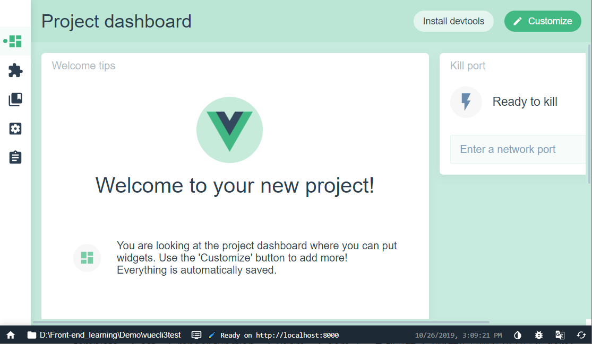
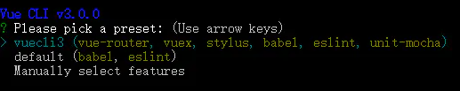
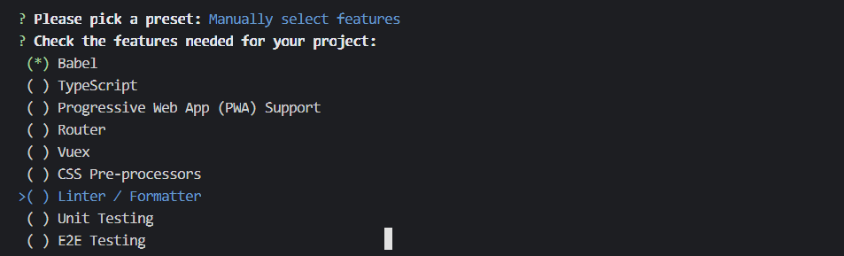
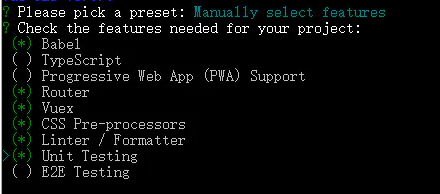
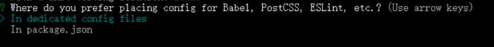
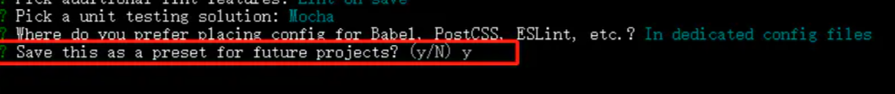

Vue 学习。
 # 一、 安装vue。
        cli命令行安装vue脚手架。
        首先全局安装 vue-cli 
            npm install  @vue/cli@3.2.1 -g
        vue 3.0 以上可以使用 vue UI  可视化窗口创建项目。
        
        ## 创建新项目。
            vue create vuecli3test
                vuecli3test 是项目的名称，项目名称不能以大写字母开头。
        现在的版本目前是这样的需要你选择你的版本，如下图进行项目配置：
        ：    按键盘上下键可以选择默认（default）还是手动（Manually），如果选择default，一路回车执行下去就行
        ： 选择配置，看项目需求
        
                注意，空格键是选中与取消，A键是全选
                    1. TypeScript 支持使用 TypeScript 书写源码
                    2. Progressive Web App (PWA) Support PWA 支持。
                    3. Router 支持 vue-router 。  <!-- 路由 -->
                    4. Vuex 支持 vuex 。 <!-- 状态管理 -->
                    5. CSS Pre-processors <!--支持 CSS 预处理器。 -->
                    6. Linter / Formatter <!-- 支持代码风格检查和格式化。 -->
                    7. Unit Testing 支持单元测试。    <!-- 没用过，之后去了解 -->
                    8. E2E Testing 支持 E2E 测试。   <!-- 没用过，之后去了解 -->
            配置文件存放地方，就是package，会有两个选项。
            
                    第一个：In dedicated config files ，是独立文件夹位置
                    第二个：是在package.json 里面。
            最后：
            
            询问是否记录这一次的配置，以便下次使用，如一开始的时候会显示的vuecli3配置。
            然后回车确定等待下载node配置。
            装好之后，启动项目
                        第一步先进入项目文件夹  cd my-project // 进入到项目根目录
                        第二步启动项目 npm run serve // 启动项目

  # 二、vue脚手架3.0 生成目录结构分析。
        就不用图片了，反正也看不到===
            目录结构：
             node_modules:依赖包目录，之后所有用到的包 都是会安装到这个文件里面。
                punlic:静态资源目录
                src：源代码
                    APP.vue:根组件
                    components:组件文件夹，可以在里面写一下公用的组件。
                    plugins:element-ui配置文件， 安装饿了么ui之后 才会出现的文件夹。
                    assets: 资源文件  一般图片啊什么的静态的资源之类的都会放在这个文件夹里面。
                    main.js:入口文件    
                    router.js：路由配置文件  安装 vue-router之后才会有的文件夹。
                    utils.js  一般写一写 二次封装的方法，方便以后的多次使用。 这个是自己新建的，项目创建初始化的时候，并不会有这个文件夹。
                package.json:包管理配置文件。 可以在这里看到一下你安装的包名，和版本号的信息。
                vue.config.js：配置文件，可以配置跨域代理。

            Vue 安装包命令， npm install xxx -g      xx 是包名称，可以跟上固定的包的版本号，npm install --save XXX（包名）@1.0.0（版本号）。

     
   # 三、之后，可以先初始化vue的css默认样式，使用normalize.css重置css的默认样式，比如默认的外边距这些。
            安装normalize.css 
                npm i normalize.css -S
            安装css-loader 和 style-loader
                npm install css-loader style-loader -S
            在main.js中全局引入normalize.css
                import "normalize.css";    import 引入 xxx 文件